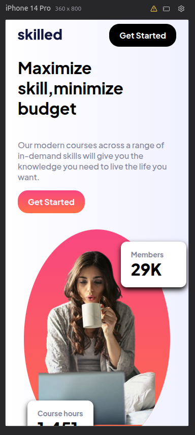
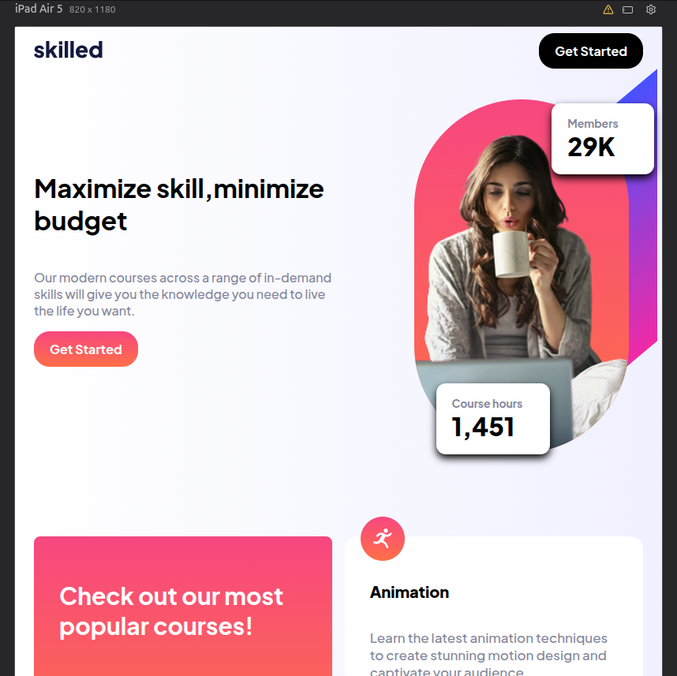
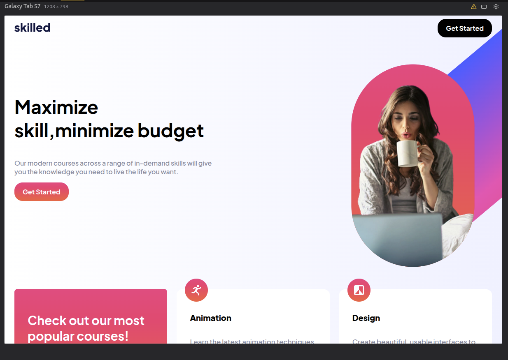

# 🚀 Landing Page - E-learning

Proyecto de práctica desarrollado con HTML, SCSS (Sass) y metodología BEM.

---

## 🌐 Demo
👉 [Ver sitio en vivo](https://proyectoelarning.vercel.app/)

---

## 🚀 Tecnologías
- HTML5
- SCSS (Sass)
- Vite

---

## 📱 Features
- Diseño responsive
- Metodología BEM
- Uso de variables y mixins
- Layout moderno con Flexbox y Grid

---

## 📸 Preview

### Mobile

### Tablet

### Desktop

---

## 🧠 Desafíos técnicos superados
- Arquitectura SCSS modular y escalable
- Maquetación con BEM + Flexbox/Grid
- Diseño responsive (mobile-first)
- Uso de variables y mixins en Sass
- Configuración de entorno con Vite

---

## 🎨 Maquetación
- Implementación de layout con Flexbox y Grid
- Uso de metodología BEM
- Componentes reutilizables (buttons, cards)

---

## 📱 Responsive
- Enfoque mobile-first
- Adaptación a múltiples breakpoints
- Uso de clamp() para tipografía fluida

---

## ⚙️ SCSS
- Variables para consistencia
- Mixins para reutilización

---

## ⚡ Entorno
- Uso de Vite como bundler
- Estructura optimizada para desarrollo

## 📝 Notas
Proyecto enfocado en maquetación y buenas prácticas de CSS.  
No incluye lógica compleja en JavaScript.